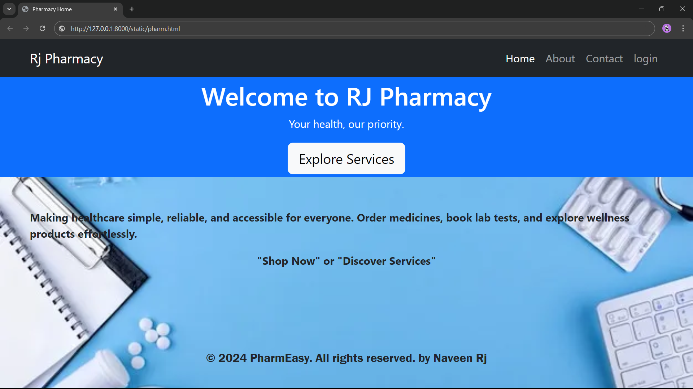
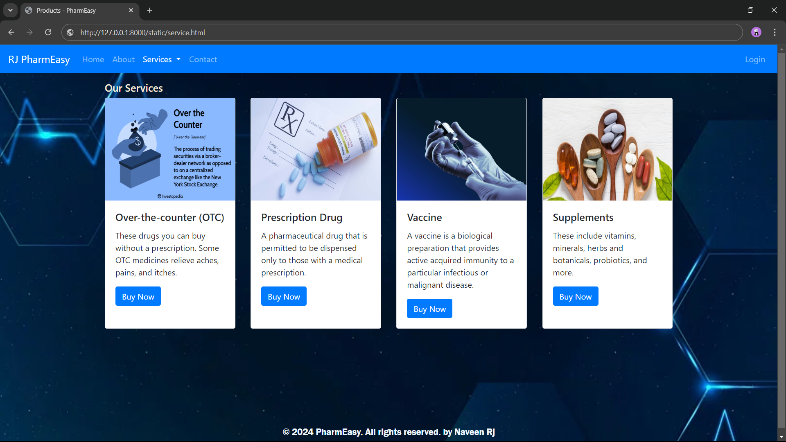
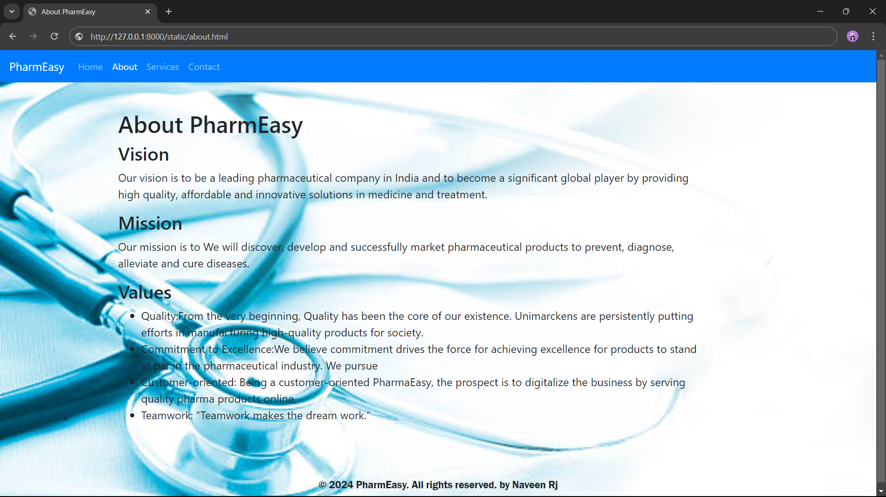
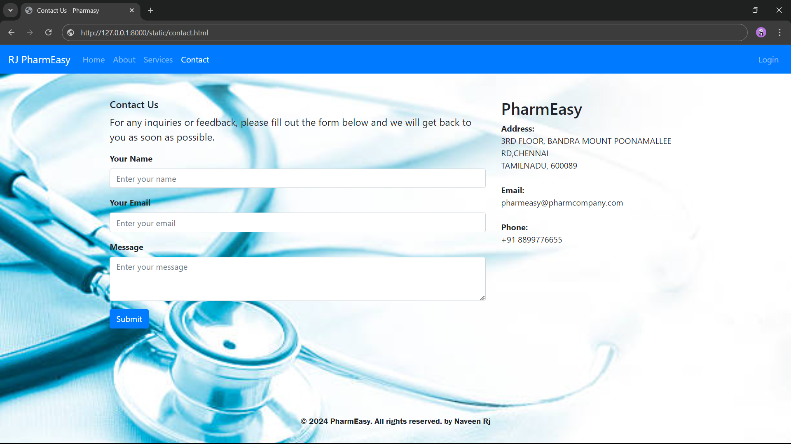
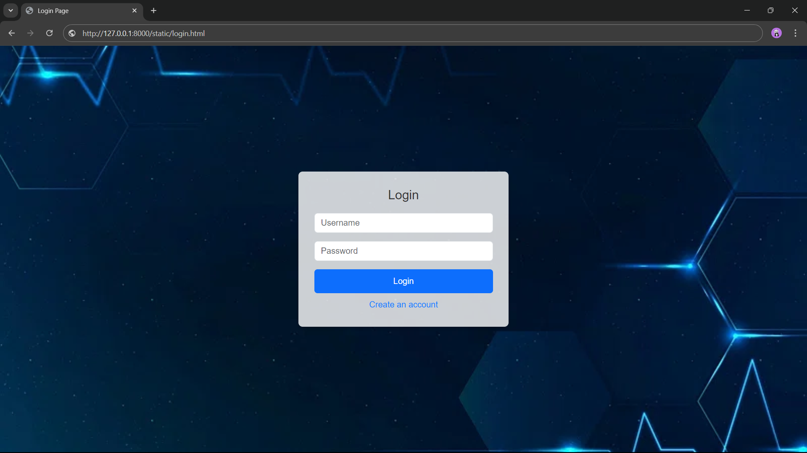

# Project Responsive Web Design using Bootstrap
# Date:
# AIM:
To create a simplified clone of Dribbble (https://dribbble.com/) landing page.

# DESIGN STEPS:
## Step 1:
Clone the repository from GitHub.

## Step 2:
Create Django Admin project.

## Step 3:
Create a New App under the Django Admin project.

## Step 4:
Insert the necessary CSS and JavaScript files as external in order to use Bootstrap.

## Step 5:
Create a HTML file and include the needed Bootstrap components.

## Step 6:
Publish the website in the LocalHost.

# PROGRAM :
pharm.html :
```
<!DOCTYPE html>
<html lang="en">
<head>
    <meta charset="UTF-8">
    <meta name="viewport" content="width=device-width, initial-scale=1.0">
    <title>Pharmacy Home</title>
    <link href="https://cdn.jsdelivr.net/npm/bootstrap@5.3.0/dist/css/bootstrap.min.css" rel="stylesheet">
</head>
<body background="" style="background-repeat: no-repeat";>
    <!-- Navbar -->
    <nav class="navbar navbar-expand-lg navbar-dark bg-dark">
        <div class="container">
            <a class="navbar-brand" href="#">Rj Pharmacy</a>
            <button class="navbar-toggler" type="button" data-bs-toggle="collapse" data-bs-target="#navbarNav" aria-controls="navbarNav" aria-expanded="false" aria-label="Toggle navigation">
                <span class="navbar-toggler-icon"></span>
            </button>
            <div class="collapse navbar-collapse" id="navbarNav">
                <ul class="navbar-nav ms-auto">
                  <li class="nav-item">
                    <a class="nav-link active" href="pharm.html">Home</a>
                </li>
                    <li class="nav-item">
                        <a class="nav-link" href="about.html">About</a>
                    </li>
                    <li class="nav-item">
                        <a class="nav-link" href="contact.html">Contact</a>
                    </li>
                    <li class="nav-item">
                        <a class="nav-link" href="login.html">login</a>
                    </li>
                </ul>
            </div>
        </div>
    </nav>

    <!-- Hero Section -->
    <div class="bg-primary text-white text-center py-1">
        <div class="container">
            <h1>Welcome to RJ Pharmacy</h1>
            <p>Your health, our priority.</p>
            <a href="product.html" class="btn btn-light btn-lg">Explore Services</a>
        </div>
    </div>

    <!-- About Section -->
    <section id="about" class="py-5">
        <div class="container">
            <p class="text-align" style="font-weight: bold;">Making healthcare simple, reliable, and accessible for everyone. Order medicines, book lab tests, and explore wellness products effortlessly.</p>
            <center><p style="font-weight: bolder;">"Shop Now" or "Discover Services"</p></center>
        </div>
    </section>

    <!-- Footer -->
    <footer style="font-size: large;"><center>
      <br><br><p style="font-family: 'Franklin Gothic Medium', 'Arial Narrow', Arial, sans-serif;">&copy; 2024 PharmEasy. All rights reserved. by Naveen Rj</p>
       </footer></center>

    <script src="https://cdn.jsdelivr.net/npm/bootstrap@5.3.0/dist/js/bootstrap.bundle.min.js"></script>
</body>
</html>

```
service.html :
```
<!DOCTYPE html>
<html lang="en">
<head>
  <meta charset="UTF-8">
  <meta name="viewport" content="width=device-width, initial-scale=1.0">
  <title>Products - PharmEasy</title>
  <!-- Bootstrap CSS -->
  <link href="https://stackpath.bootstrapcdn.com/bootstrap/4.5.2/css/bootstrap.min.css" rel="stylesheet">
</head>
<body>

  <!-- Navbar -->
  <nav class="navbar navbar-expand-lg navbar-dark bg-primary">
    <a class="navbar-brand" href="#">RJ PharmEasy</a>
    <button class="navbar-toggler" type="button" data-toggle="collapse" data-target="#navbarSupportedContent" aria-controls="navbarSupportedContent" aria-expanded="false" aria-label="Toggle navigation">
      <span class="navbar-toggler-icon"></span>
    </button>
    <div class="collapse navbar-collapse" id="navbarSupportedContent">
      <ul class="navbar-nav mr-auto">
        <li class="nav-item">
          <a class="nav-link" href="pharm.html">Home</a>
        </li>
        <li class="nav-item">
          <a class="nav-link" href="about.html">About</a>
        </li>
        <li class="nav-item active dropdown">
          <a class="nav-link dropdown-toggle" href="#" id="navbarDropdown" role="button" data-toggle="dropdown" aria-haspopup="true" aria-expanded="false">
            Services
          </a>
          <div class="dropdown-menu" aria-labelledby="navbarDropdown">
            <a class="dropdown-item" href="#">Over-the-counter (OTC) Medications</a>
            <a class="dropdown-item" href="#">Prescription Drugs</a>
            <a class="dropdown-item" href="#">Vaccines</a>
            <a class="dropdown-item" href="#">Supplements</a>
          </div>
        </li>
        <li class="nav-item ">
          <a class="nav-link" href="contact.html">Contact</a>
        </li>
      </ul>
      <ul class="navbar-nav ml-auto">
        <li class="nav-item">
          <a class="nav-link" href="login.html">Login</a>
        </li>
          </ul>
    </div>
  </nav>

  <!-- Page Content -->
  <div class="container mt-3">
    <div class="row">
      <div class="col-md-12">
        <h5 style="color: antiquewhite;">Our Services</h5>
        <div class="card-deck">
          <div class="card">
            
            <div class="card-body">
              <h5 class="card-title">Over-the-counter (OTC)</h5>
              <p class="card-text">These drugs you can buy without a prescription. Some OTC medicines relieve aches, pains, and itches.</p>
              <a href="#" class="btn btn-primary">Buy Now</a>
            </div>
          </div>
          <div class="card">
            
            <div class="card-body">
              <h5 class="card-title"> Prescription Drug</h5>
              <p class="card-text">A pharmaceutical drug that is permitted to be dispensed only to those with a medical prescription.</p>
              <a href="#" class="btn btn-primary">Buy Now</a>
            </div>
          </div>
          <div class="card">
            
            <div class="card-body">
              <h5 class="card-title">Vaccine</h5>
              <p class="card-text">A vaccine is a biological preparation that provides active acquired immunity to a particular infectious or malignant disease.</p>
              <a href="#" class="btn btn-primary">Buy Now</a>
            </div>
          </div>
          <div class="card">
            
            <div class="card-body">
              <h5 class="card-title">Supplements</h5>
              <p class="card-text">These include vitamins, minerals, herbs and botanicals, probiotics, and more.</p>
              <a href="#" class="btn btn-primary">Buy Now</a>
            </div>
          </div>
        </div>
      </div>
    </div>
  </div>

  <!-- Footer -->
  <footer style="font-size: large; color: aliceblue;"><center>
   <br><br><br><br><br><br><br> <p style="font-family: 'Franklin Gothic Medium', 'Arial Narrow', Arial, sans-serif;">&copy; 2024 PharmEasy. All rights reserved. by Naveen Rj</p>
  </footer></center>
  <body background="https://images.rawpixel.com/image_800/czNmcy1wcml2YXRlL3Jhd3BpeGVsX2ltYWdlcy93ZWJzaXRlX2NvbnRlbnQvbHIvcm0zNzNiYXRjaDE1LWJnLTExLmpwZw.jpg" style="background-repeat: no-repeat; background-size: cover;">


  <!-- Bootstrap JS -->
  <script src="https://code.jquery.com/jquery-3.5.1.slim.min.js"></script>
  <script src="https://cdn.jsdelivr.net/npm/popper.js@1.16.1/dist/umd/popper.min.js"></script>
  <script src="https://stackpath.bootstrapcdn.com/bootstrap/4.5.2/js/bootstrap.min.js"></script>
</body>
</html>
```

about.html :
```
<html>
  <head>
    <meta charset="UTF-8">
   <meta name="viewport" content="width=device-width, initial-scale=1.0">
   <title>About PharmEasy</title>
  <!-- Bootstrap CSS -->
  <link href="https://stackpath.bootstrapcdn.com/bootstrap/4.5.2/css/bootstrap.min.css" rel="stylesheet">
</head>
<body>

  <!-- Navbar -->
  <nav class="navbar navbar-expand-lg navbar-dark bg-primary">
    <a class="navbar-brand" href="#">PharmEasy</a>
    <button class="navbar-toggler" type="button" data-toggle="collapse" data-target="#navbarSupportedContent" aria-controls="navbarSupportedContent" aria-expanded="false" aria-label="Toggle navigation">
      <span class="navbar-toggler-icon"></span>
    </button>

    <div class="collapse navbar-collapse" id="navbarSupportedContent">
      <ul class="navbar-nav mr-auto">
        <li class="nav-item">
          <a class="nav-link" href="pharm.html">Home</a>
        </li>
        <li class="nav-item active">
          <a class="nav-link" href="about.html">About</a>
        </li>
        <li class="nav-item">
          <a class="nav-link" href="product.html">Services</a>
        </li>
        <li class="nav-item">
          <a class="nav-link" href="contact.html">Contact</a>
        </li>
      </ul>
    </div>
  </nav>

  <!-- Page Content -->
  <div class="container mt-5">
    <div class="row">
      <div class="col-md-11">
        <h1>About PharmEasy</h1>
        <div id="vision">
          <h2>Vision</h2>
          <p style="font-size: larger;">Our vision is to be a leading pharmaceutical company in India and to become a significant global player by providing high quality, affordable and innovative solutions in medicine and treatment.</p>
        </div>
        <div id="mission">
          <h2>Mission</h2>
          <p style="font-size: larger;">Our mission is to We will discover, develop and successfully market pharmaceutical products to prevent, diagnose, alleviate and cure diseases.</p>
        </div>
        <div id="values">
          <h2>Values</h2>
          <ul>
            <li style="font-size: larger;">Quality:From the very beginning, Quality has been the core of our existence. Unimarckens are persistently putting efforts in manufacturing high-quality products for society.</li>
            
            <li style="font-size: larger;">Commitment to Excellence:We believe commitment drives the force for achieving excellence for products to stand at par in the pharmaceutical industry. We pursue </li>
            <li style="font-size: larger;">Customer-oriented: Being a customer-oriented PharmaEasy, the prospect is to digitalize the business by serving quality pharma products online.</li>
            <li style="font-size: larger;">Teamwork: “Teamwork makes the dream work.”</li>
          </ul>
        </div>
        <br>
        <!-- Add more subheadings as needed -->
      </div>
    </div>
  </div>
  <body background="https://media.istockphoto.com/id/532963888/photo/medical-or-science-with-soft-light-background.jpg?b=1&s=612x612&w=0&k=20&c=JSzu_zobekbCCuTeoFGirR7eF5JysHAste1T8G6Yzvs=" style="background-repeat: no-repeat; background-size: cover;"></body>
  <!-- Footer -->
  <footer style="font-size: large;"><center>
  <br><br><p style="font-family: 'Franklin Gothic Medium', 'Arial Narrow', Arial, sans-serif;">&copy; 2024 PharmEasy. All rights reserved. by Naveen Rj</p>
   </footer></center>

  <!-- Bootstrap JS -->
  <script src="https://code.jquery.com/jquery-3.5.1.slim.min.js"></script>
  <script src="https://cdn.jsdelivr.net/npm/popper.js@1.16.1/dist/umd/popper.min.js"></script>
  <script src="https://stackpath.bootstrapcdn.com/bootstrap/4.5.2/js/bootstrap.min.js"></script>
</body>
</html>
```
contact.html :
```
<!DOCTYPE html>
<html lang="en">
<head>
  <meta charset="UTF-8">
  <meta name="viewport" content="width=device-width, initial-scale=1.0">
  <title>Contact Us - Pharmasy</title>
  <!-- Bootstrap CSS -->
  <link href="https://stackpath.bootstrapcdn.com/bootstrap/4.5.2/css/bootstrap.min.css" rel="stylesheet">
</head>
<body>

  <!-- Navbar -->
  <nav class="navbar navbar-expand-lg navbar-dark bg-primary">
    <a class="navbar-brand" href="#">RJ PharmEasy</a>
    <button class="navbar-toggler" type="button" data-toggle="collapse" data-target="#navbarSupportedContent" aria-controls="navbarSupportedContent" aria-expanded="false" aria-label="Toggle navigation">
      <span class="navbar-toggler-icon"></span>
    </button>

    <div class="collapse navbar-collapse" id="navbarSupportedContent">
      <ul class="navbar-nav mr-auto">
        <li class="nav-item">
          <a class="nav-link" href="pharm.html">Home<span class="sr-only">(current)</span></a>
        </li>
        <li class="nav-item">
          <a class="nav-link" href="about.html">About<span class="sr-only">(current)</span></a>
        </li>
        <li class="nav-item">
          <a class="nav-link" href="product.html">Services<span class="sr-only">(current)</span></a>
        </li>
        <li class="nav-item active">
          <a class="nav-link" href="contact.html">Contact <span class="sr-only">(current)</span></a>
        </li>
      </ul>
      <ul class="navbar-nav auto">
        <li class="nav-item">
          <a class="nav-link" href="login.html">Login</a>
        </li>
          </ul>
    </div>
  </nav>

  <!-- Page Content -->
  <div class="container mt-5">
    <div class="row">
      <div class="col-md-8">
        <h5 style="font-size: larger;">Contact Us</h5>
        <p style="font-size: larger;">For any inquiries or feedback, please fill out the form below and we will get back to you as soon as possible.</p>
        <form>
          <div class="form-group">
            <label for="name" style="font-weight: bolder;">Your Name</label>
            <input type="text" class="form-control" id="name" placeholder="Enter your name">
          </div>
          <div class="form-group">
            <label for="email" style="font-weight: bolder;">Your Email</label>
            <input type="email" class="form-control" id="email" placeholder="Enter your email">
          </div>
          <div class="form-group">
            <label for="message" style="font-weight: bolder;">Message</label>
            <textarea class="form-control" id="message" rows=3 placeholder="Enter your message"></textarea>
          </div>
          <button type="submit" class="btn btn-primary">Submit</button>
        </form>
      </div>
      <div class="col-md-4">
        <h2>PharmEasy</h2>
        <address>
          <strong>Address:</strong><br>
          3RD FLOOR, BANDRA MOUNT POONAMALLEE RD,CHENNAI<br>
          TAMILNADU, 600089<br><br>
          <strong>Email:</strong><br>
          pharmeasy@pharmcompany.com<br><br>
          <strong>Phone:</strong><br>
          +91 8899776655
        </address>
      </div>
    </div>
  </div>
 
  <body background="https://media.istockphoto.com/id/532963888/photo/medical-or-science-with-soft-light-background.jpg?b=1&s=612x612&w=0&k=20&c=JSzu_zobekbCCuTeoFGirR7eF5JysHAste1T8G6Yzvs=" style="background-repeat: no-repeat; background-size: cover;">

    <br>
    <br>
  <!-- Footer -->
  <footer><center>
    <br><br><br><br><br><p style="font-family: 'Franklin Gothic Medium', 'Arial Narrow', Arial, sans-serif;">&copy; 2024 PharmEasy. All rights reserved. by Naveen Rj</p>
   </footer></center>

  <!-- Bootstrap JS -->
  <script src="https://code.jquery.com/jquery-3.5.1.slim.min.js"></script>
  <script src="https://cdn.jsdelivr.net/npm/popper.js@1.16.1/dist/umd/popper.min.js"></script>
  <script src="https://stackpath.bootstrapcdn.com/bootstrap/4.5.2/js/bootstrap.min.js"></script>
</body>
</html>

```
login.html :
```
<!DOCTYPE html>
<html lang="en">
<head>
    <meta charset="UTF-8">
    <meta name="viewport" content="width=device-width, initial-scale=1.0">
    <title>Login Page</title>
    <!-- Bootstrap CSS -->
    <link href="https://cdn.jsdelivr.net/npm/bootstrap@5.3.0/dist/css/bootstrap.min.css" rel="stylesheet">
    <style>
        body {
            margin: 0;
            padding: 0;
            font-family: Arial, sans-serif;
            background: url('https://images.rawpixel.com/image_800/czNmcy1wcml2YXRlL3Jhd3BpeGVsX2ltYWdlcy93ZWJzaXRlX2NvbnRlbnQvbHIvcm0zNzNiYXRjaDE1LWJnLTExLmpwZw.jpg') no-repeat center center fixed;
            background-size: cover;
            height: 100vh;
        }

        .login-container {
            background: rgba(255, 255, 255, 0.8);
            padding: 30px;
            border-radius: 8px;
            box-shadow: 0 4px 8px rgba(0, 0, 0, 0.2);
            max-width: 400px;
            width: 100%;
            text-align: center;
        }

        .login-container h1 {
            margin-bottom: 20px;
            font-size: 24px;
            color: #333;
        }

        .form-control {
            margin-bottom: 15px;
        }

        .btn-primary {
            width: 100%;
            padding: 10px;
        }

        .login-container a {
            display: block;
            margin-top: 10px;
            text-decoration: none;
            color: #007BFF;
        }

        .login-container a:hover {
            text-decoration: underline;
        }
    </style>
</head>
<body class="d-flex justify-content-center align-items-center">
    <div class="login-container">
        <h1>Login</h1>
        <form action="/login" method="POST">
            <div class="mb-3">
                <input type="text" class="form-control" name="username" placeholder="Username" required>
            </div>
            <div class="mb-3">
                <input type="password" class="form-control" name="password" placeholder="Password" required>
            </div>
            <button type="submit" class="btn btn-primary">Login</button>
        </form>
        <a href="/register">Create an account</a>
    </div>
    <!-- Bootstrap JS -->
    <script src="https://cdn.jsdelivr.net/npm/bootstrap@5.3.0/dist/js/bootstrap.bundle.min.js"></script>
</body>
</html>

```

# OUTPUT:










# RESULT:
The Project for responsive web design using Bootstrap is completed successfully.
``